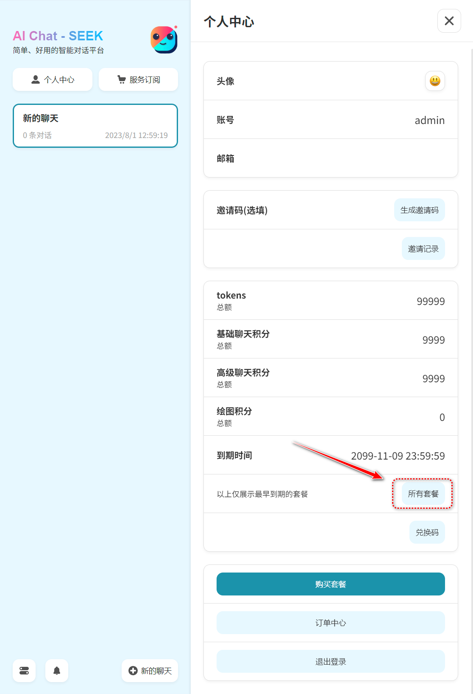

# 使用文档

## AIChat简介

AIChat是一款跨多个AI平台和模型的集成式服务平台，您在使用AIChat时可以体验到人工智能行业各个领先者、佼佼者的不同的AI服务，其中包括广为人知的ChatGPT、Cluade、Midjourney、sd、通义千问、文心一言等，本教程将向您介绍如何使用AIChat进行对话。

### 使用教程

使用AIChat进行对话非常简单。您只需知道以下几点

**对话**
- 在对话开始时，您可以输入一条问题、指令或任何您想要与AIChat交流的内容，AIChat将根据您的输入生成一条回复，当百度用(不同类型的对话请新建对话，因为每个对话都自带记忆)。

**Tokens**
- AIChat不会在服务端保留AI的记忆，即您的每一次提问和答复都会被附带请求中，送到对应AI平台以供其分析，也就是说您在同一窗口的对话越多，消耗的字数（tokens）就越多。您也可以在设置中限制每次附带的消息的条数（默认携带4条聊天记录）。

**面具**
- 面具是一系列设置好的对话记录，面具内参数可根据话题类型，自行调整，不同参数回答结果天差地别。使用面具时，AI将按照面具中的提示来处理您的请求。您也可以自定义自己的面具以供未来使用，或分享给他人。

**联网查询**
- AI所了解的知识都是有限时间段的，我们通过接入互联网让其在处理您的问题时更加智能、先进，而不会存在当下的某些新的新闻或知识AI不清楚的情况。

---

### 如何查看个人额度及订阅信息

在任意对话中，点击顶部小人图标即可查看所有个人信息以及订阅信息.
> 为防止数据错乱，该页面的套餐信息为注册赠送套餐信息点击“所有套餐”可查询所有套餐信息

---

