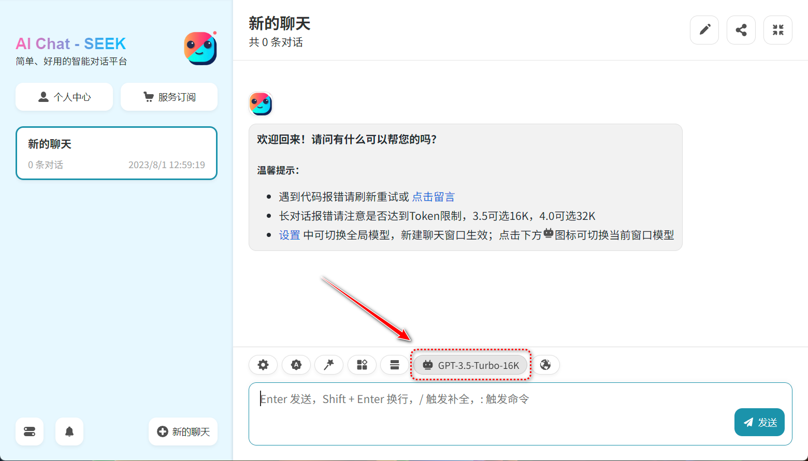

# 常见问题

Q1：
```json
{"success":false,"content":"","tokenCount":0,"errorMessage":null,"inputTokens":4096,"outputTokens":3}
```
D1：超出模型tokens上限，检查你现在是不是使用额3.5-turbo模型，如果是请更换为3.5-16k的模型

Q2：如果不知道怎么切换模型，点击点击下方![icon](data:image/svg+xml,%3Csvg%20class%3D%22robot_svg__icon%22%20viewBox%3D%220%200%201024%201024%22%20xmlns%3D%22http%3A//www.w3.org/2000/svg%22%20width%3D%2216%22%20height%3D%2216%22%3E%3Cpath%20d%3D%22M717.12%20274H762c82.842%200%20150%2067.158%20150%20150v200c0%2082.842-67.158%20150-150%20150H262c-82.842%200-150-67.158-150-150V424c0-82.842%2067.158-150%20150-150h44.88l-18.268-109.602c-4.086-24.514%2012.476-47.7%2036.99-51.786%2024.514-4.086%2047.7%2012.476%2051.786%2036.99l20%20120c.246%201.472.416%202.94.516%204.398h228.192c.1-1.46.27-2.926.516-4.398l20-120c4.086-24.514%2027.272-41.076%2051.786-36.99%2024.514%204.086%2041.076%2027.272%2036.99%2051.786L717.12%20274zM308%20484v40c0%2024.852%2020.148%2045%2045%2045s45-20.148%2045-45v-40c0-24.852-20.148-45-45-45s-45%2020.148-45%2045zm318%200v40c0%2024.852%2020.148%2045%2045%2045s45-20.148%2045-45v-40c0-24.852-20.148-45-45-45s-45%2020.148-45%2045zM312%20912c-24.852%200-45-20.148-45-45s20.148-45%2045-45h400c24.852%200%2045%2020.148%2045%2045s-20.148%2045-45%2045H312z%22%20fill%3D%22%23515151%22%3E%3C/path%3E%3C/svg%3E)图标可切换当前窗口模型

D2：

